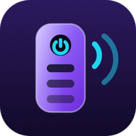
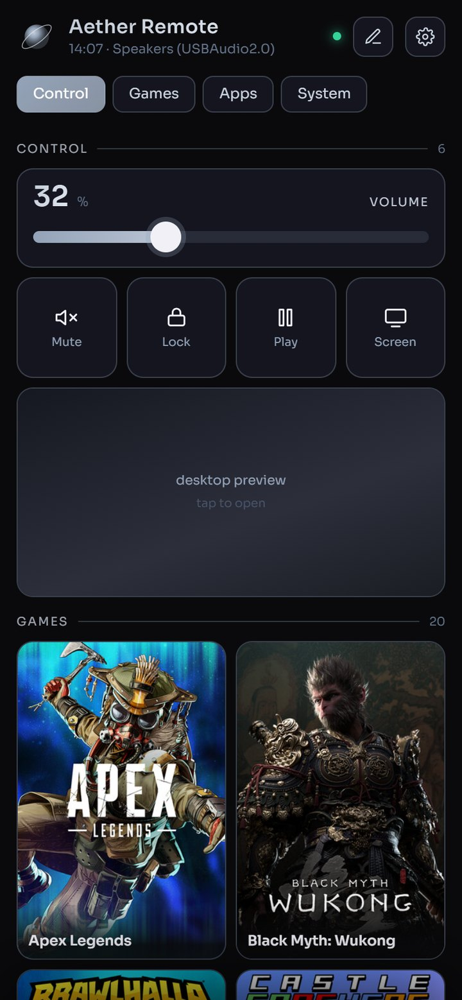
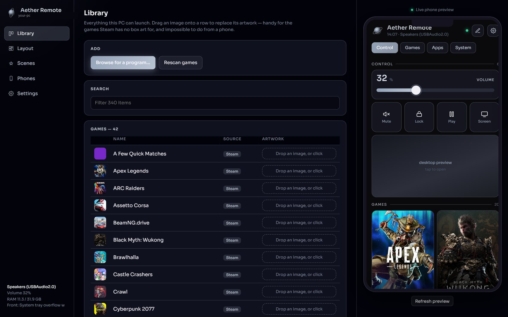
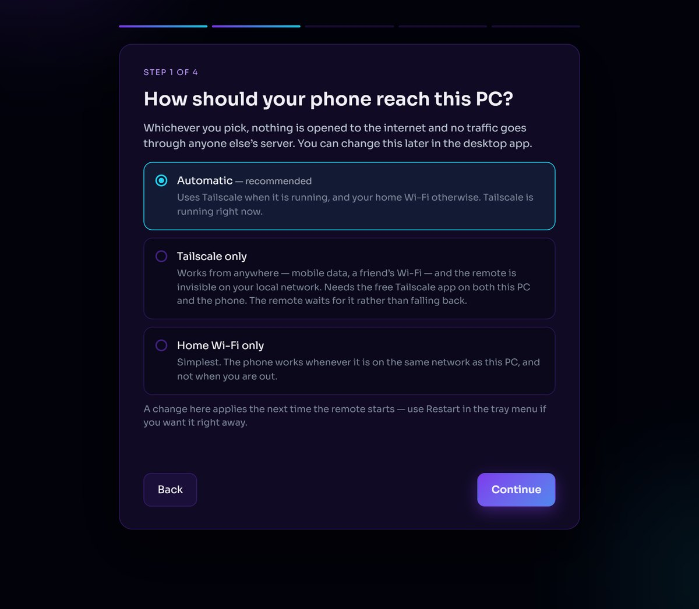
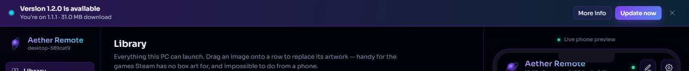

<div align="center">



# Aether Remote

**Turn your phone into a real remote for your Windows PC.**

Volume, media and power. Your games and apps, with their actual box art.
And the whole desktop as a live screen you can tap, scroll and type on.

[](../../releases/latest)
&nbsp;




</div>

---

## What it does

Install it on the PC you want to control. Scan a QR code with your phone.
That's the setup.

From then on your phone has a grid of tiles you arrange yourself:

- **Volume that actually works.** A real slider, plus a *volume lock* that
  pins the level — for games that yank it to 100% on launch.
- **Your library, found automatically.** It scans Steam, Epic, Xbox and the
  Start Menu and pulls in the real box art, the way a console does.
- **Media and power keys** — play/pause, skip, lock, sleep, screen off.
- **The whole desktop, live and usable.** Full screen, tap to click, hold to
  right-click, two fingers to scroll. Tap the box at the bottom and your
  phone's own keyboard types straight into whatever is focused on the PC —
  search something, press Enter, done. A toolbar covers what a phone keyboard
  has no key for: Esc, Tab, Copy, Paste, the arrows, Win, Alt+Tab.
- **Built by you.** Drag tiles around, resize them, group them into sections,
  and recolour the whole app from two hex values.

It runs entirely on your own network or your own Tailscale tailnet. There is
no account, no cloud service, and nothing of yours leaves your machine.

---

## The desktop app

The PC side is not an afterthought. It does the things a phone is bad at —
browsing for a program, dragging artwork onto a game, arranging a layout on a
big screen — and shows a live preview of the phone while you do it.

<div align="center">

</div>

Drag any image onto a row to replace its artwork, which is how you fix the
handful of games Steam has no box art for.

---

## Getting started

1. **Download the installer** from [Releases](../../releases/latest) and run it.
   It installs for you only, so it needs no admin rights for the app itself.
2. **The setup wizard opens by itself.** Four steps, about two minutes.
3. **Scan the QR code** with your phone and add the site to your home screen —
   the app walks you through that, in your phone's own words.

<div align="center">

</div>

### If Windows or your antivirus objects

Both warnings come from the same cause: this app is **not code-signed**,
because a certificate costs a few hundred dollars a year.

**SmartScreen — "Windows protected your PC."** Click *More info → Run anyway*.
Every unsigned installer gets this.

**Defender — "Trojan:Win32/Wacatac.B!ml."** A false positive. The `!ml` suffix
means a machine-learning guess rather than a match against known malware. The
installer is one file that unpacks itself into a temp folder and runs from
there — which is exactly what a dropper does — so a brand-new unsigned file
of that shape gets flagged until it has a download history. The
**portable zip** on the releases page has nothing self-extracting in it, so
that heuristic has nothing to trigger on.

Rather than take anyone's word for it: the source is all here, the build is
one command, and every release lists the SHA-256 of both downloads so you can
check that what you got is what was built.

### Reaching it from outside the house

The wizard offers three ways for your phone to find the PC:

| Mode | Works from | Needs |
|---|---|---|
| **Automatic** | anywhere, if Tailscale is on; otherwise home Wi-Fi | nothing |
| **Tailscale only** | anywhere — mobile data, a friend's Wi-Fi | the free [Tailscale](https://tailscale.com) app on both devices |
| **Home Wi-Fi only** | the same network as the PC | nothing |

Nothing is ever exposed to the public internet in any of them.

---

## How it works

A small HTTP server runs on the PC and serves the phone UI. Everything else
is built around three problems worth explaining.

### Logging in

The phone logs in with a 6-digit code from any authenticator app —
[RFC 6238](https://datatracker.ietf.org/doc/html/rfc6238) TOTP, implemented in
about eighty lines of standard library, no dependencies. A successful code
returns an HMAC-signed session cookie good for 30 days.

Two details that matter more than the algorithm:

- **A code works exactly once.** The counter it came from is recorded, so a
  code someone reads over your shoulder is already spent by the time they
  type it.
- **Five wrong codes locks that IP out for five minutes**, which turns a
  six-digit space into something you cannot brute force.

The setup wizard will not let you finish until a real code from your real
phone has been accepted — because the one failure you cannot fix remotely is
being locked out of your own PC.

### Talking to Windows

There is no wrapper library here; it is `ctypes` against the Win32 API.

- **Volume** goes through the CoreAudio COM interfaces (`IMMDeviceEnumerator`,
  `IAudioEndpointVolume`). Every call is funnelled onto one worker thread,
  because those objects are apartment-bound and will fail in confusing ways
  otherwise. Mute applies to *every* active output device, not just the
  default one.
- **Icons** come from the Windows shell image list at 256px
  (`SHGetFileInfo` → `SHGetImageList` → `IImageList::GetIcon`), rather than
  `ExtractAssociatedIcon`, which only ever returns 32×32.
- **The tray icon** is `Shell_NotifyIconW` with a hidden message window and a
  real `WNDPROC` callback.

### Streaming the desktop

Capture is `StretchBlt` straight from the display DC into a scaled bitmap
that is reused between frames, then `GetDIBits` into a buffer Pillow reads as
BGRX with no conversion pass. That replaced `ImageGrab.grab` plus a Pillow
resize — 70 ms a frame, measured — with about 27 ms.

The phone asks for **one frame at a time**, and only once the last one is on
screen. The obvious design is MJPEG over `multipart/x-mixed-replace`, and
that is what this used to do; the problem is that the server pushes frames
whether or not the phone can keep up, so on any connection slower than the
stream they queue in buffers and the picture drifts steadily behind the real
screen. Tapping something you can see is useless if it moved two seconds ago.
A request-per-frame loop cannot fall behind — the round trip *is* the frame
rate — so a slow link costs frame rate instead of latency, and the picture is
always the newest one. If frames start taking long enough to feel dead, the
phone drops a quality tier by itself and says so.

Touches are sent as coordinates normalised 0–1 within the chosen monitor, so
the phone never needs to know the resolution. They arrive as `SetCursorPos`
and `SendInput`, with typing sent as Unicode key events so it works in any
application.

### Staying alive

A remote is useless if you have to walk to the PC to start it. Three layers
keep it up, and each one covers the layer below it failing:

```
scheduled task  (at logon, then every 5 minutes)
      └── supervisor  ── restarts the server within ~7s of any crash
                      └── restarts the tray within 60s
```

The task fires unconditionally and the supervisor holds a named mutex, so a
second copy exits instantly. That replaced an earlier version which read
`netstat` to decide whether things were already running — and matched sockets
left in `TIME_WAIT` by a server that had just died, so it reported healthy at
exactly the moment recovery was needed.

It runs in your logged-in session, deliberately, not as a Windows service. A
session-0 service cannot capture the screen or inject input, which would break
screen sharing entirely.

---

## Staying current

Most people never check whether software they installed has a new version, so
the app checks for them: once a day, against this repository's releases feed,
and it says so in a bar across the top of the desktop page.

<div align="center">

</div>

Everything about it is deliberately boring. Nothing downloads until you press
the button. **More info** shows the release notes for the version being
offered, rendered from the Markdown on the release itself. The **✕** hides
that version permanently — and only that version, so the next one still
speaks up. The choice is stored on the PC, not in the browser, so it holds
across phones and browsers, and Settings can hand it back.

Pressing **Update now** fetches the installer over HTTPS from a host list
pinned in the source, checks the file really is a Windows program before
touching it, and hands off. The installer stops the running copy, replaces the
program folder, leaves your data folder alone and starts the new version; the
page waits for the server to go down and come back, then reloads itself. No
admin prompt, because the firewall rule and the scheduled task already exist
and still point at the same folder.

---

## Add-ons

**[Homelab](add-ons/homelab/)** — control a Proxmox server from the same
phone app. It appears in the PC switcher as another device: live server stats,
start/stop VMs and containers, restart services. One line in the Proxmox shell
installs it:

```bash
bash -c "$(curl -fsSL https://raw.githubusercontent.com/builtbycodyrd/aether-remote/main/add-ons/homelab/install.sh)"
```

Add-ons are versioned separately from the Windows app (tags like
`homelab-v0.1.0`), so an add-on update never shows up as a PC update.

---

## Building it yourself

```bash
git clone https://github.com/builtbycodyrd/aether-remote.git
cd aether-remote
pip install pillow qrcode

python launch.py --server        # the HTTP server
python launch.py                 # the tray app
python launch.py --supervise     # the supervisor
```

Packaged, those three are one `AetherRemote.exe` told apart by that flag:

```bash
pip install pyinstaller
pyinstaller --noconfirm AetherRemote.spec
```

Only two third-party dependencies — Pillow and qrcode. Everything else is the
standard library or raw `ctypes`.

### Where things live

| | |
|---|---|
| `launch.py` | the single entry point, and the mode flags |
| `paths.py` | the rule for what is *program* and what is *your data* |
| `remote.py` | the HTTP server and every API route |
| `auth.py` | TOTP and session cookies |
| `sysctl.py` | volume, media keys, power, the volume lock |
| `stream.py` | screen capture and input injection |
| `library.py` | finding your games and their artwork |
| `layout.py` | the tile model, the theme, icon extraction |
| `tray.py` | the Windows tray app |
| `supervise.py` | keeps the server and tray running |
| `installer.py` | builds `AetherRemoteSetup.exe` |

The program folder and your data folder are separate: the app lives in
`%LOCALAPPDATA%\Programs\Aether Remote`, and your settings, layout, icon cache
and authenticator secret live in `%LOCALAPPDATA%\Aether Remote`. An update
replaces the first and never touches the second.

---

## Security, honestly

This app can set your volume, launch programs, type into whatever is focused
and watch your screen. That deserves a straight account of how it is locked
down and where the edges are.

**What protects it**

- No account, no cloud relay, no port forwarding. It binds to your Tailscale
  address or your LAN, never the public internet.
- TOTP to log in, single-use codes, five-attempt lockout, HMAC-signed session
  cookies with a 30-day expiry you can revoke from the desktop app.
- **The phone can never send a command to run.** It names a tile ID; the
  server looks up the launch path it discovered itself. A forged request with
  a command in it is dropped, and there is a test that proves it.
- The first-run wizard answers only the PC itself, never the network, and
  refuses everyone once setup is finished.
- Uploaded artwork is validated as a real image before it is written.

**What to be aware of**

- Anyone already on your tailnet or your Wi-Fi can reach the login page. The
  TOTP code is what stands between them and your desktop.
- Your authenticator secret is stored unencrypted in your own user profile.
  Anyone who can read your files can already do far worse.
- The installer is not code-signed, so SmartScreen will warn on first run.
- Screen sharing sends unencrypted JPEG frames over your local network or
  tailnet. Tailscale encrypts that end to end; plain Wi-Fi does not.

Found something? Open an issue.

---

## Licence

MIT — see [LICENSE](LICENSE). Do what you like with it.

<div align="center">
<sub>Built by <a href="https://github.com/builtbycodyrd">builtbycodyrd</a></sub>
</div>
